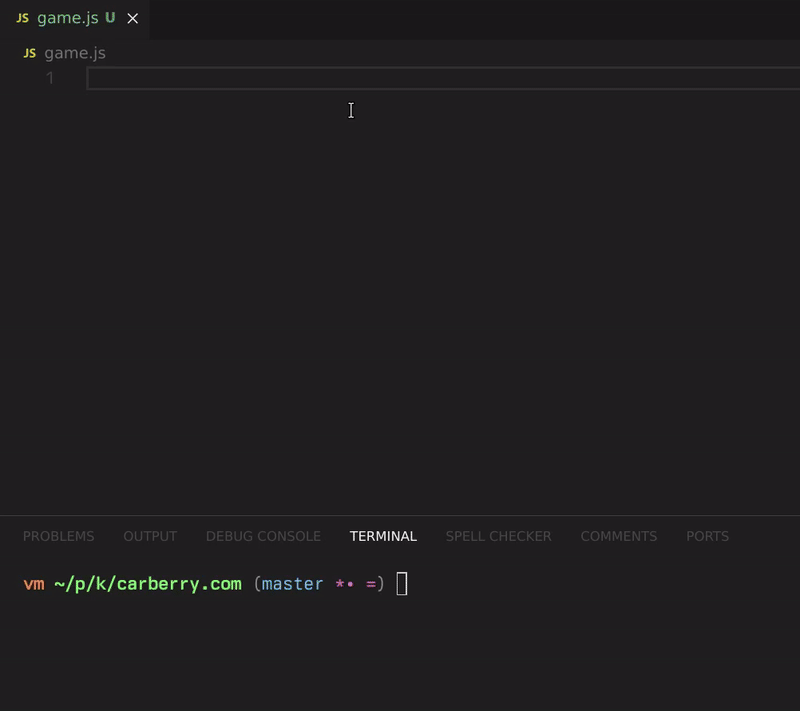
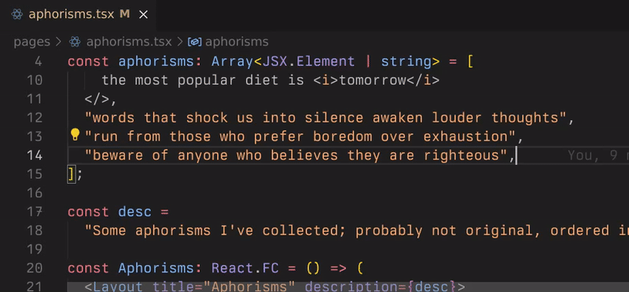
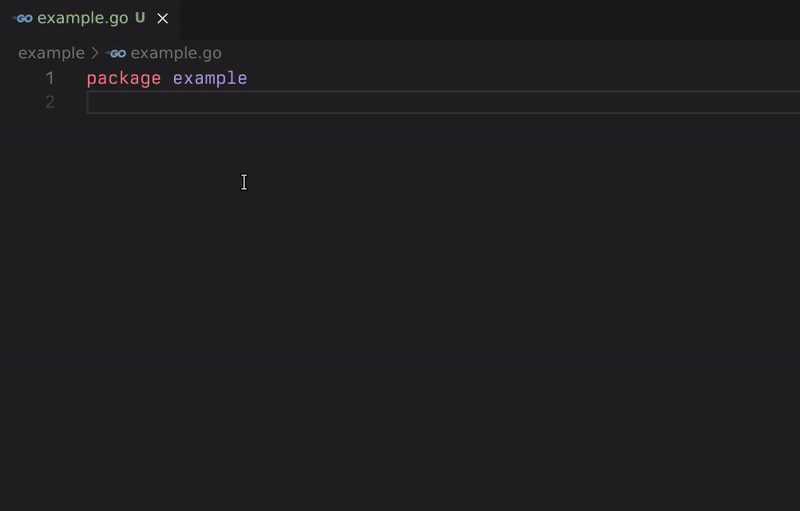

<h1>
    
    Picopilot
</h1>

[](https://marketplace.visualstudio.com/items?itemName=coder.picopilot)

[GitHub Copilot](https://marketplace.visualstudio.com/items?itemName=GitHub.copilot) in [70 lines of JavaScript](./extension.js).

System Prompt:

```text
You provide code completion results given a prefix and suffix.

Respond with a JSON object with a key 'completion' containing the suggestion to place between the prefix and suffix.

Follow existing code styles. Listen to comments at the end of the prefix. The language is "${document.languageId}".
```

Response Format:

```json
{
  "completion": "<code>"
}
```

## Demos

_All demos are unedited._

### Creating a terminal game



### Generating aphorisms



### Using the GitHub API



## Install

Launch VS Code Quick Open (Ctrl+P), paste the following command, and press enter.

```text
ext install coder.picopilot
```

## Development

Clone the repository, run `bun install`, `bun watch`, open VS Code, and press F5 to launch the extension in development mode.

Create your own AI extensions from this repo. It's remarkably simple!
